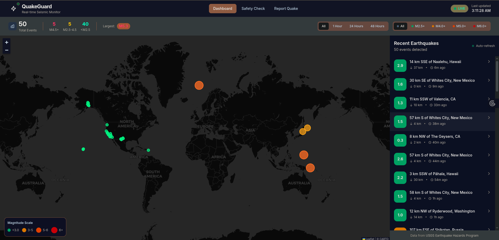

# QuakeGuard

QuakeGuard is a real-time seismic monitoring platform that visualizes earthquake data on an interactive world map. It features:

- Live earthquake event ingestion from USGS
- Interactive map with magnitude-based color coding
- Recent earthquake list with details
- Safety check and felt report forms
- Modern, dark, glassmorphic UI

## Features
- Real-time global earthquake monitoring
- Magnitude and time-based filtering
- Animated map markers for seismic events
- User safety and felt report submission
- Built with React, Tailwind CSS, Spring Boot, PostgreSQL

## Quick Start
1. Clone the repo: `git clone https://github.com/dirshaye/QuakeGuard.git`
2. Start with Docker Compose: `docker compose up --build`
3. Visit the frontend at [http://localhost:5173](http://localhost:5173)

## Security Notice
**Do not use default passwords in production!**

---

Data from USGS Earthquake Hazards Program.
